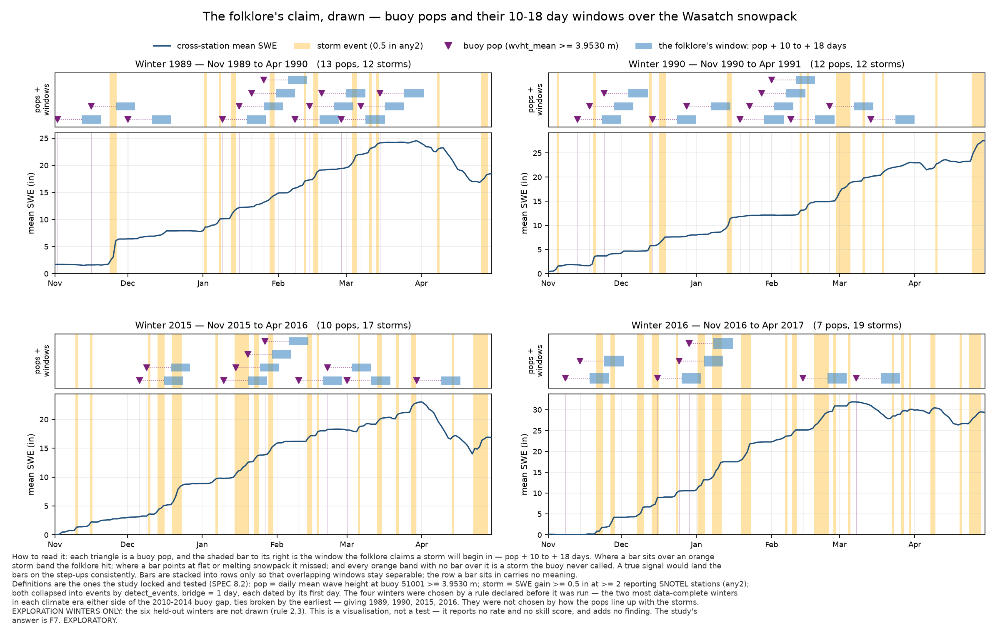
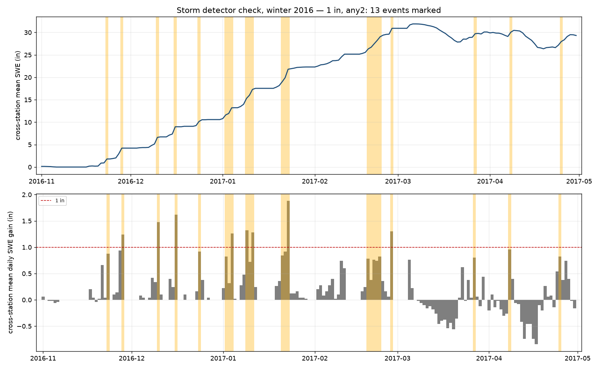
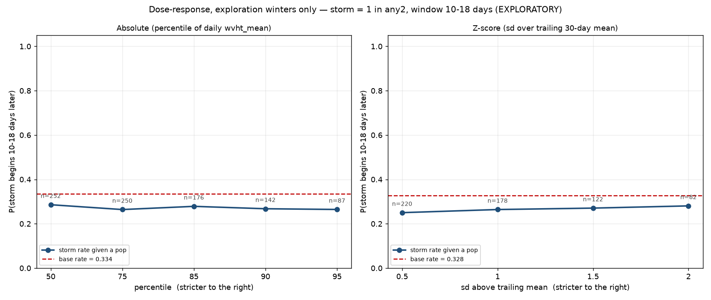
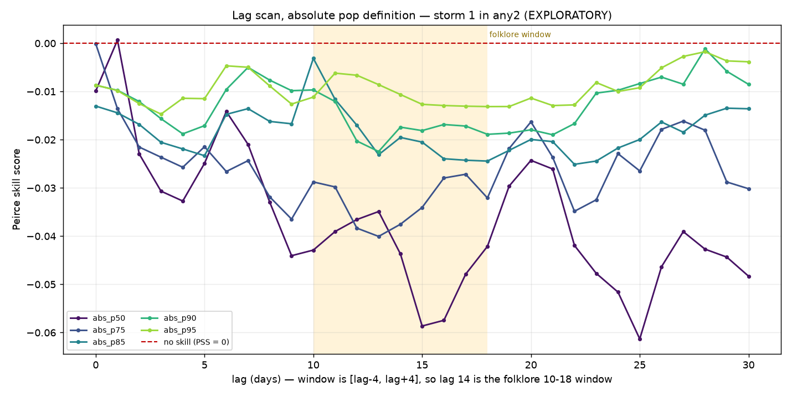
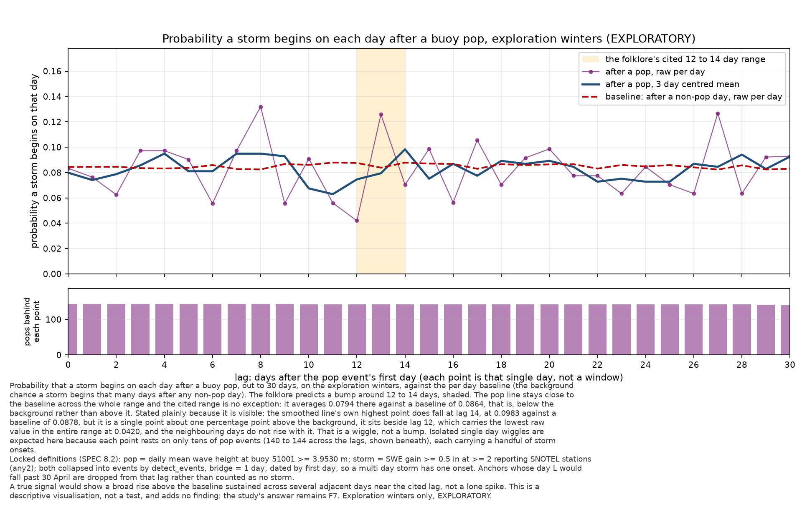
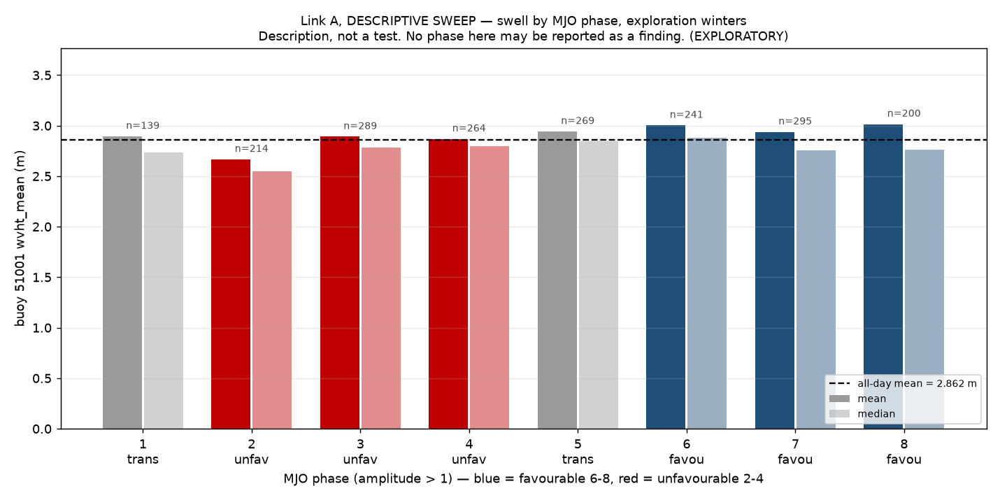

# Powder Buoy

**In brief.** Does a wave-height spike at NOAA buoy 51001, near Hawaii, predict a storm in
Utah's Wasatch mountains 10–18 days later? If anything about that works, the buoy cannot be
tracking the storm itself; it would have to be a proxy for the MJO and the North Pacific
storm track. The rule was explored on 16 winters, then run once on 6 held-out winters that
were sealed until the rule and its pass mark were locked. After a pop a storm followed
0.6818 of the time, against a base rate of 0.6339: a ratio of 1.0755 against a pre-declared
bar of 1.20, so the null is confirmed. The chain breaks at the first link: swell is higher in
the favourable MJO phases by only 0.18 of a standard deviation.



*The folklore's claim, drawn over four winters (1989, 1990, 2015, 2016). Each triangle is a
buoy pop and the bar to its right is the window in which the folklore says a storm will
begin, 10 to 18 days later; the orange bands are detected storm events on the cross-station
mean SWE curve. A bar over an orange band is a hit, a bar over flat or melting snowpack is a
miss, and an orange band with no bar over it is a storm the buoy never called. The bars do
not line up with the step-ups. The four winters were chosen by a rule declared before the
figure was drawn (the two most data-complete winters in each climate era either side of the
2010–2014 buoy gap, ties broken by the earliest), not by how the pops line up with the
storms. Definitions are the locked rule's: pop = daily mean wave height at 51001 of at least
3.9530 m, storm = SWE gain of at least 0.5 inches at two or more reporting stations.
Exploration winters, EXPLORATORY.*

A test of whether a Pacific Ocean buoy near Hawaii predicts snowstorms in Utah's Wasatch
mountains about two weeks later. It does not, and this repository is the record of how
that was established, on winters no part of the test was tuned on.

The project is complete. [`process/SPEC.md`](process/SPEC.md) is the method and the source
of truth, [`process/STATUS.md`](process/STATUS.md) the state,
[`process/DECISIONS.md`](process/DECISIONS.md) the open questions and the findings log.
Every number below is quoted from one of those files or from a report in `outputs/`; nothing
here was computed for the write-up.

---

## The claim

Since the mid-2000s a community of Utah skiers has watched NOAA buoy 51101, a discus buoy a
few hundred kilometres northwest of Kauai. The rule they use is simple:

> When wave height spikes ("a buoy pop"), the Wasatch gets a storm about two weeks later.
> Bigger pop, bigger storm.

The claim has a real following and a self-reported accuracy of around 80%, over small
samples, with no baseline ever quoted beside it. No published study of it exists. That
missing baseline is the whole story, and it is what this project set out to supply.

## Why it cannot work the way it is described

The usual explanation is that a low-pressure system passes the buoy and later arrives over
Utah. The timing does not work. Long-period ocean swell travels roughly 1,000 km per day, so a storm near the Aleutians sends swell to Hawaii within three to five days with the storm’s weather reaching Utah in roughly the same amount of time, not fourteen days. Whatever the buoy is seeing, it is not the storm that later hits the Wasatch.

If a real signal exists, then, the buoy has to be a *proxy for a large-scale atmospheric
pattern* rather than a tracker of individual storms. The obvious candidate is the
Madden–Julian Oscillation (MJO), a band of tropical convection that circles the globe on a
30–60 day cycle and is an established source of subseasonal predictability: it modulates the
North Pacific jet, which drives atmospheric rivers into the western United States. An active
North Pacific storm track would produce both bigger swell at Hawaii and, one to three weeks
later, more storms over Utah. The buoy would be a symptom, not a cause.

That is the version of the folklore worth testing, and it is why this study exists.

## What we did

**The predictor.** NOAA buoy 51001, whose archive runs from February 1981 to the end of 2025.
51001 sits in the same deep water northwest of Kauai as the famous 51101 but has a far longer
record: 51101's archive does not begin until February 2008, so it did not exist for most of
the winters studied here. Where the two overlap they agree closely: same-day daily-mean wave
heights correlate at 0.98 over 3,738 overlapping days, which is what licenses 51001 as the
stand-in. 51001's own record is not clean either: 22.2% of days are missing, including a
continuous 2,068-day hole from December 2009 to August 2015. Gaps were left as gaps and
counted, never filled.

**The target.** Snow water equivalent (SWE) from five Wasatch SNOTEL stations: Snowbird,
Brighton, Mill-D North, Thaynes Canyon and Louis Meadow. SWE is the depth of water you would
get if you melted the snowpack; a daily gain in SWE is the storm signal. It is automated,
physically meaningful and consistently measured, which snowfall reports are not.

**Events, not days.** Winter weather is heavily autocorrelated: if it snowed today it
probably snowed yesterday, and a five-day swell is one weather system, not five. Both pops
and storms were therefore collapsed into discrete *events*, each dated by its first day, so
that one system is counted once.

**A sealed held-out set.** This is the discipline that makes the answer worth anything. The
22 usable winters were split before any analysis: 16 **exploration** winters where anything
was permitted (scan every lag, try every threshold, change your mind) and 6 **held-out**
winters (2004, 2005, 2006, 2008, 2021, 2022) that no code read and no person looked at until
the test was written down and frozen. The rule below was fixed in advance, in
[`process/SPEC.md`](process/SPEC.md) Section 8, including the number it had to beat, and
then run **once**. The seal is now spent and cannot be re-sealed.

**The rule that was locked and run.** A *pop day* is a day with a daily mean significant wave
height at 51001 of at least **3.9530 m**, the 90th percentile of the exploration winters,
carried across as a fixed value in metres and deliberately *not* recomputed on the held-out
winters. A *storm day* is a day with an SWE gain of at least **0.5 inches at two or more of
the reporting SNOTEL stations**; that definition was chosen because it detects 15.4 storm
events per winter, inside the 15–30 a Wasatch winter plausibly contains, where the more
conventional 1.0-inch threshold finds only 6.9 and is really detecting a storm's biggest day
rather than the storm. The detector was validated against an independent instrument before it
was trusted: at the 1.0-inch definition, 111 of 111 SWE-detected storm events coincide within
a day with a gauge precipitation increment at two or more stations, the gauge being a
physically separate instrument from the snow pillow at the same sites, so this is
corroboration rather than circularity. The question asked of each pop is the folklore's own:
**does a storm begin between 10 and 18 days later?** One window, no lag scan, no second look.



*The storm detector checked by eye against a single winter (2016): the 13 events it marks,
shaded, on the cross-station mean SWE curve (top) and the daily SWE gains beneath it. The
marks land on genuine step-ups in the snowpack rather than on flat or melting stretches,
evidence that a flat result reflects the buoy, not a broken detector. Drawn at the 1-inch
`any2` definition; the locked rule uses 0.5 inch. Exploration winters, EXPLORATORY.*

**The bar, written down before the winters were opened.** The rule would count as showing
skill only if the storm rate after a pop was at least **1.20 times** the base rate *and* the
Peirce skill score was positive, under both of two declared ways of matching pops to storms.

## The finding

> After a buoy pop, a storm followed within 10–18 days **68%** of the time on the held-out
> winters (storm rate given a pop **0.6818**). But on days with no pop, a storm *also*
> followed within 10–18 days **63%** of the time (base rate **0.6339**). The pop moved the
> odds from 63% to 68%, a ratio of **1.0755**, far below the 1.20 bar set before the data was
> seen, and well within noise on six winters. **Verdict: NULL CONFIRMED.** The buoy tells you
> almost nothing you did not already know from the fact that it is winter in Utah.

The full 2×2, over 44 pop events, 893 non-pop comparison days, 97 storm events and 1,086
winter days:

| | Storm began in window | No storm in window |
| --- | --- | --- |
| Pop occasion | 30 | 14 |
| Non-pop occasion | 564 | 329 |

Both declared matching variants (one where each pop must claim a storm no earlier pop has
already claimed, one where each pop is scored independently) came out **exactly identical**,
which is the strongest form the "report both" requirement could have taken: the verdict does
not depend on the matching rule. The buoy reported on all 1,086 held-out winter days and all
five snow stations reported on every one of them, so no day had to be guessed at.



*The same null in its visual form, on the exploration winters: storm rate given a pop swept
from the loosest pop threshold to the strictest, against the base rate (dashed). The curve
does not climb as the threshold tightens and never rises above its own base rate: at 0 of 5
absolute thresholds and 0 of 4 z-score thresholds. Drawn at the stricter 1-inch `any2` storm
definition, which is why its base rate sits near 0.33 rather than the 0.63 the 0.5-inch
definition gives above. Exploration winters, EXPLORATORY.*

The Peirce skill score came out at **+0.0097**, fractionally positive where the exploration
winters were fractionally negative, and nowhere near skill. That sliver was disarmed in
advance rather than after the fact: the protocol states, in text written before the winters
were unsealed, that six winters give a *directional* answer and that a ratio near 1.0 cannot
be distinguished from a ratio of 1.15 on this sample. No effect size may be read off 1.0755.

**This was not a surprise sprung by the held-out set.** The exploration winters showed the
same flat picture first. At the identical configuration the storm rate given a pop there was
0.5563 against a base rate of 0.6308 with claiming, and 0.6197 against 0.6308 without: at or
slightly below the base rate, not above it. Across all 54 exploration configurations of pop
threshold, snow threshold and station-combination rule, the storm rate given a pop sat below
its own base rate in every single one under the conservative matching rule, and in 32 of the
54 under the other. And a scan of every lag from 0 to 30 days found no signal to
lock onto: of 279 lag × pop-threshold combinations, exactly one had a positive skill score, at
+0.00066, and the longest run of consecutive positive lags at any threshold was one. A real
atmospheric signal would show a broad bump across neighbouring lags, because weather patterns
persist for days. There was no bump.



*Peirce skill score against lag, 0 to 30 days, for the five absolute pop definitions, with
the folklore's own 10–18 day window shaded. The curves sit below the no-skill line at very
nearly every lag, inside the folklore window and outside it, with no broad bump anywhere for
a real regime signal to have made. The lone point that clears zero, at lag 1, is the +0.00066
quoted above: the only positive score in the whole 279-combination scan. Exploration winters, storm = 1 inch
`any2`, EXPLORATORY.*



*The same question asked one day at a time rather than through a nine-day window, since a
window could smear a sharp, narrowly timed signal. For each lag from 0 to 30 days it plots
the fraction of pop events whose day L is the first day of a storm event, against the same
fraction from non-pop days, with the folklore's cited 12 to 14 day range shaded and a 3-day
centred mean drawn beside the raw line. It is flat: the pop line sits on the baseline across
the whole range, and in the cited range it averages 0.0794 against a baseline of 0.0864,
below the background rather than above it. Locked definitions throughout (pop at 3.9530 m,
storm at 0.5 inch `any2`). Exploration winters, EXPLORATORY.*

Because the simple counting test found nothing, no model was ever built. That was a gate set
in the specification before the data was touched: if contingency tables show nothing, a model
will not find a signal that is absent; it will find a more elaborate way to overfit.

## Why so many people believe it

The base rate is the answer, and it is worth stating plainly, because the illusion is a
genuinely easy one to fall into.

A Wasatch winter contains something like 16 storms. Ask "will a storm start in the next nine
days?" on a random winter day and the answer is yes about 63% of the time, for free, with no
buoy, no forecast and no skill whatsoever. Against that, "a storm followed 68% of the time
after a pop" stops sounding like a discovery. It is 63% wearing a hat.

What makes it feel convincing is that the hits are memorable and the misses are not. Someone
watching the buoy sees a pop, sees snow twelve days later, and files it as confirmation. What
they never tally are the two other categories: the ordinary winter days with no pop that were
followed by a storm anyway (564 of the 893 comparison days here) and the pops followed by
nothing, 14 of 44. Nobody keeps that ledger, so the rule accumulates a long record of apparent
successes while never being tested at all.

This is the failure mode the project's own rule 2.2, *no accuracy figure may ever be reported
without its baseline beside it*, exists to prevent. The folklore's "80% accurate" is not a
lie. It is a number with the interesting half removed.

## What was not tested

The null is a real result, and it is a narrow one. Stated explicitly so no reader over-reads
it:

- **Wave height only.** Not swell *period* or *direction*. A long-period swell from the
  northwest is the physical signature of a distant, energetic North Pacific storm, while
  short-period swell is local wind chop, and filtering for the former is the most physically
  motivated of the untested alternatives. It was deliberately not tried here, because testing
  variables until one clears a bar the declared one failed is exactly the trap the sealed set
  exists to prevent. It would need a fresh study with its own sealed winters. The popular
  accounts of the folklore do describe height spikes, which is what was tested.
- **One buoy, one mountain range, 22 usable winters.** One combined snow signal across five
  stations, not per-canyon behaviour: Little Cottonwood and Big Cottonwood can get very
  different snow from the same system, and that was not separately tested.
- **The MJO mechanism is itself weak here, and ambiguous.** Swell at 51001 genuinely is higher
  in the MJO phases the hypothesis predicts (2.98 m against 2.82 m) but the difference is
  only 0.18 of a standard deviation, invisible on any given day. That is where the folklore's
  chain actually breaks: the buoy is a very crude MJO index, too crude to read. The MJO→snow
  half of the chain was weaker still, and it disagreed between the pre-2014 and post-2014
  eras (at the 1.0-inch storm definition, a lagged favourable-versus-unfavourable rate ratio
  of 0.906 before the boundary against 1.507 after), which is confounded with a
  change in how the MJO index itself is calculated at the end of 2013. A data artefact and a
  genuine two-decade difference cannot be separated in this record, and no attempt was made to
  pretend otherwise.

  

  *Daily mean wave height at 51001 by MJO phase, on coherent-MJO days only (amplitude > 1),
  against the all-day mean of 2.862 m (dashed). The figure is a descriptive sweep and says so
  on its face: no individual phase in it is a finding. The declared test behind it groups the
  favourable phases 6–8 against the unfavourable 2–4 and gives the 2.98 m against 2.82 m above:
  the direction the hypothesis predicts, and only 0.18 of a standard deviation of it. That is
  the whole of the mechanism the folklore would need. Exploration winters, EXPLORATORY.*
- **Six held-out winters give a directional answer, not a precise one.** The held-out set was
  sized by the buoy's own five-year archive gap, and that limitation was accepted knowingly
  when the winters were split, not discovered afterwards.
- **Everything except the final test is exploratory.** Only the single held-out run is a
  confirmed finding. The lag scan, the mechanism check and the detector validation are all
  labelled EXPLORATORY in [`process/DECISIONS.md`](process/DECISIONS.md) and none may be
  read as a conclusion.

## Conclusion

The powder-buoy folklore, as it is actually stated and as it was tested here, does not hold: a
wave-height spike at 51001 does not raise the odds of a Wasatch storm 10–18 days later beyond
the base rate. The most likely explanation is that the rule is mostly the base-rate illusion,
resting on a mechanism that measurement finds too weak to carry a signal.

A null, cleanly demonstrated, was an accepted outcome from the first version of the
specification: *"a result of 'no, the buoy adds nothing' is a complete and successful
outcome. This is stated here deliberately so that no later session feels pressure to find a
signal."* That is the result.

## The repository

| Path | What it is |
| --- | --- |
| [`process/SPEC.md`](process/SPEC.md) | The specification and source of truth: the question, the data, the critical rules, and Section 8 (the evaluation protocol, frozen before the held-out winters were opened and preserved exactly as written) |
| [`process/STATUS.md`](process/STATUS.md) | Current state, the build log session by session, and the data state |
| [`process/DECISIONS.md`](process/DECISIONS.md) | Open questions (Q1–Q32) and the findings log (F1–F7). F7 is the answer; F4–F6 are why it fails; F1–F3 are what was measured on the way |
| [`process/`](process/README.md) | How the project was run: spec, status, decisions log and every session prompt, archived as-is |
| `src/powderbuoy/ingest/` | `ndbc.py`, `snotel.py`, `climate.py`: download and clean buoy, snow and climate-index data |
| `src/powderbuoy/seasons.py` | The season split, and the loader that excludes the held-out winters by default |
| `src/powderbuoy/events.py` | Event detection, contingency tables, the lag scan |
| `src/powderbuoy/mjo.py` | The mechanism check: MJO ↔ swell and MJO ↔ snow |
| `src/powderbuoy/holdout_eval.py` | The single held-out run |
| `outputs/` | Every report and figure the analysis produced, including `phase7_holdout_result.txt` (the answer) and `experiments/register.csv` (the audit trail); the six figures above are embedded from `outputs/figures/`, which also holds the z-score lag scan, the MJO snow link, the 2013/14 seam check and raw-data winter plots |
| `config/regions/utah.yaml` | Station identifiers and the winter lists. No station ID is hardcoded in a module |
| `tests/` | 69 tests |
| [`LICENSE`](LICENSE) | MIT |

Data is not committed (`data/raw/` and `data/processed/` are gitignored) because every byte
of it is freely downloadable from NOAA, the USDA NRCS and the Australian Bureau of Meteorology,
and regenerating it is one command per source.

## Reproducing it

Python 3.11+ and [`uv`](https://docs.astral.sh/uv/). No API keys, no database server, no cloud
account; everything runs on one machine against Parquet files on disk.

```bash
uv sync                                        # install dependencies

uv run python -m powderbuoy.ingest.ndbc        # buoys 51001, 51101 -> buoy_daily.parquet
uv run python -m powderbuoy.ingest.snotel      # 5 Wasatch stations -> snow_daily.parquet
uv run python -m powderbuoy.ingest.climate     # MJO/ENSO/PDO -> climate_daily.parquet,
                                               #   then the join -> analysis_daily.parquet

uv run python -m powderbuoy.events             # contingency tables + lag scan (exploration only)
uv run python -m powderbuoy.mjo                # the MJO mechanism check (exploration only)
uv run python -m powderbuoy.mjo --seam-check   # the same tests either side of the 2013/14 seam

uv run pytest tests/ -v                        # 69 tests
```

Every script takes `--region` (default `utah`) and `--seed` (default 42), reads raw downloads
that are never modified in place, and writes its report into `outputs/`.

`src/powderbuoy/holdout_eval.py` is the one-shot held-out run and the only place in the
project that passes `include_holdout=True`. Re-running it reproduces the recorded numbers from raw
data, which is the point of keeping it; it does not constitute a second test. The seal was
spent on 2026-08-09 and anything computed on those six winters from now on is exploratory
forever.

## How this was built

The owner designed the study and directed it through written session prompts, one per
session. Claude Code wrote the code, working from those prompts. Every rule and every
decision is recorded in [`process/`](process/README.md), which explains how the files were
used and in what order to read them.

## A note on method

The specific answer here is about a buoy. The disciplines that produced it transfer to any
claim of the same shape, and they are most of what this repository is actually worth reading
for:

- **Put the baseline next to every rate, always.** "68% accurate" and "68% against a 63% base
  rate" are the same measurement and opposite conclusions.
- **Seal some data away before you start, and open it once.** Every choice (threshold, lag,
  station set, matching rule) was made on winters that the final test never saw. That is the
  only thing that makes the final number honest, and it works only if you do not go back.
- **Write the decision rule down before you look**, including the number it has to beat and
  what each possible outcome will mean. It is astonishingly easy to talk yourself into a bar
  after you have seen the result; it is impossible if the bar is already in a frozen document.
- **Count events, not autocorrelated days.** A five-day swell is one pop. Treating it as five
  inflates every sample size and every apparent significance in the analysis.
- **Gate the complicated tool behind the simple one.** Counting comes first, and the model
  only gets built if counting finds something to explain. Here it did not, so no model was
  built. Machine learning applied to an absent signal does not report "nothing here"; it
  reports an elaborate way of overfitting.
- **Say what you did not test.** A narrow null stated narrowly is durable. The same null
  oversold is just a different kind of folklore.
